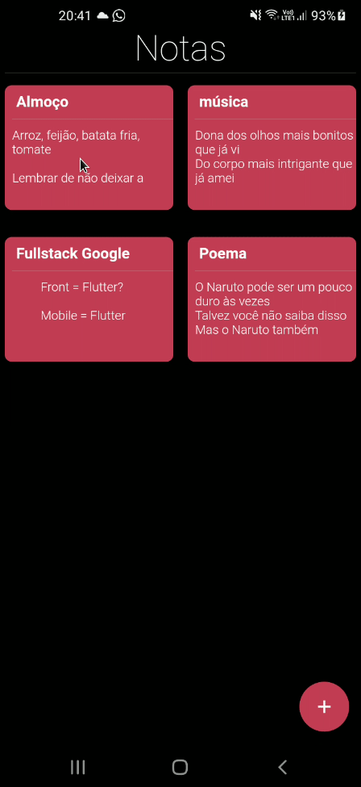

# Notas

Meu primeiro aplicativo funcional feito em Flutter.

A ideia principal era fazer um todo-list, porém tive a ideia de adicionar algumas coisas, aprender o básico do Hive para servir como banco de dados offline, date_format, google_fonts(tenho quase certeza que não está funcionando) e o flutter_staggered_grid_view.

## Informações importantes
O projeto foi feito em um dia, quis retardar um pouco em dois para tentar melhorar o UI/UX, porém ainda faltou algumas coisas, como por exemplo a ação da página fazer um scroll automático assim que a área de escrever a nota fosse acionada.

Irei voltar no futuro para fazer algumas melhorias, talvez um fork para ter features a mais como um menu, login com a conta do Google e um backup online das notas.